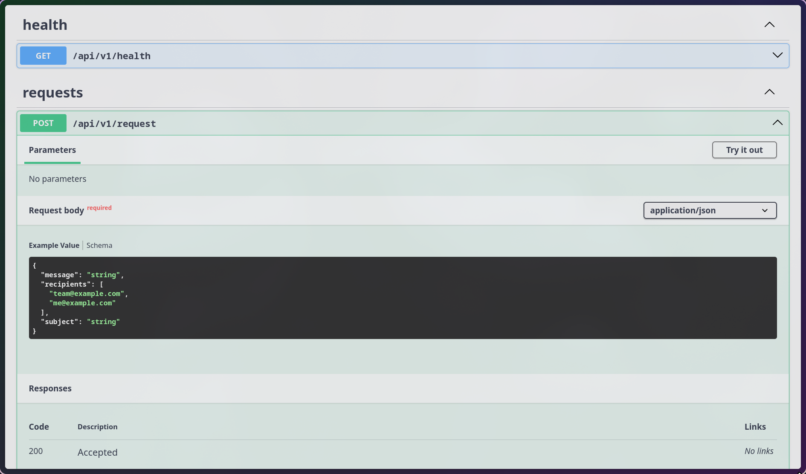

# Vue 3 + TypeScript + Vite + SMTP Backend

Commercial web application with a Vue 3 frontend and a lightweight SMTP-enabled backend.

To inspect outgoing emails locally, create the file:

```bash
logs/email_sent.log
```

---

## About the Project

**Live website:** [https://akbalans.ru](https://akbalans.ru)

This is a **commercial project**.
The source code is published in this repository **with the client’s permission** and is intended **for portfolio and review purposes only**.

### Demo

#### Frontend


#### Backend simple SMTP server



---

## Legal Notice

⚠️ **All rights reserved.**

This repository is shared **strictly for viewing and evaluation**.
The code **may not be copied, reused, modified, redistributed, or used in any form** without explicit written permission from the author and the client.
